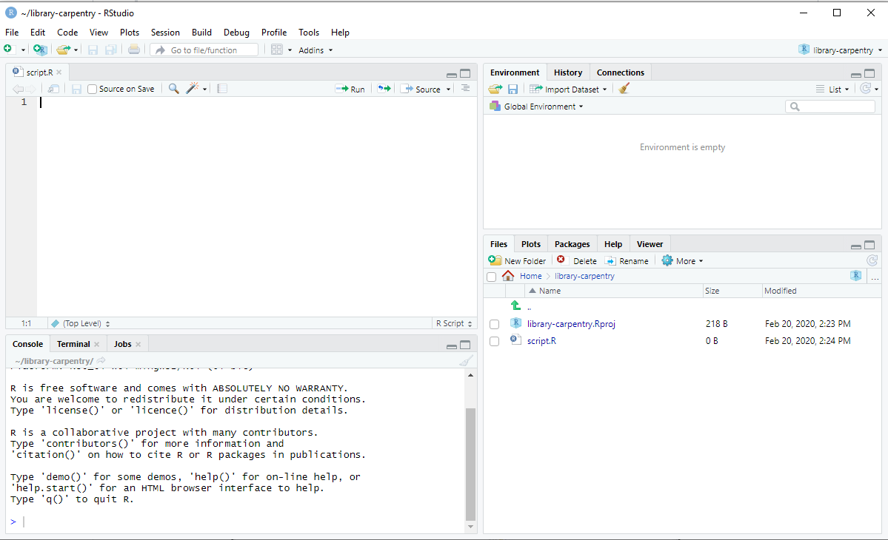

## What is R?
R is more of a programming language than a statistics program. You can use R to create, import, and scrape data from the web; clean and reshape it; visualize it; run statistical analysis and modeling operations on it; text and data mine it; and much more. 

R is also free and open source, distributed under the terms of the GNU General Public License. This means it is free to download and use the software for any purpose, modify it, and share it. As a result, R users have created thousands of packages and software to enhance user experience and functionality. 

When using R, you have a console window with a blinking cursor, and you type in a command according to the R syntax in order to make it do something. This can be intimidating for people who are used to Graphical User Interface (GUI) software such as Excel, where you use the mouse to point and click, and never or seldom have to type anything into the interface in order to get it to do something. While this can be seen as a drawback, it actually becomes a great advantage once you learn the R language, as you are not bound by the options presented to you in a GUI, but can craft flexible and creative commands.

## What is RStudio?
RStudio is a user interface for working with R. You can use R without RStudio, but it’s much more limiting. RStudio makes it easier to import datasets, create and write scripts, and has an autocomplete activated for functions and variables you’ve already assigned. RStudio makes using R much more effective, and is also free and open source.

## RStudio Console
After you install and open RStudio, you will see a window with four panes. You may need to open the top left "Source" pane by clicking on the maximize icon.

## Console Pane (bottom left)
If you were just using the basic R interface, without RStudio, this is all you would see. You use this to type in a command and press enter to immediately evaluate it. It includes a > symbol and a blinking cursor prompting you to enter some code. You can type R code into the bottom line of the RStudio console pane and then click `Enter` to run it. The code you type is called a command, because it will command your computer to do something for you. The line you type it into is called the `command line`.

When you type a command at the prompt and hit Enter, your computer executes the command and shows you the results. Then RStudio displays a fresh prompt for your next command. For example, if you type 1 + 1 and hit Enter, RStudio will display:

~~~
## type in 1 plus 1
> 1+1
[1] 2
>
~~~
{: .language-r}

Code that you type directly in the console will not be saved, though it is available in the History Pane. 

## Script Pane (top left)
This is sort of like a text editor, or a place to write and save code. You then tell RStudio to run the line of code, or multiple lines of code, and you can see it appear in the console as it is running. Then save the script as a .R file for future use, or to share with others. 

To execute code you use Ctrl+Enter (Cmd+Enter on a Mac). To create a new .R script file, use File > New File > R Script, and to open a script, use File > Open, or Recent Files to see files you’ve worked with recently. Save the R script by going to File > Save.

If you type an incomplete command and press Enter, R will display a `+` prompt, which means R is waiting for you to type the rest of your command. Either finish the command or hit Escape to start over:

~~~
## type in 6 subtracted from and leave it blank
> 6 -
+
+ 1
[1] 5
~~~
{: .language-r}

If you type a command that R doesn’t recognize, R will return an error message.

~~~
## type in 3 % 7
> 3 % 7
Error: unexpected input in "3 % 7"
>
~~~
{: .language-r}

Once you understand the command line, you can easily do anything in R that you would do with a calculator. In its simplest form, R can be used as an interactive calculator. 

~~~
## type in 5 plus 7
> 5 + 7
[1] 12

## type in 2 multiplied by 4
> 2 * 4   
## 8

## type in 8 subtracted by 1
> 8 - 1   
## 7

## type in 6 divided by (3 -1)
> 6 / (3 - 1)   
## 3
~~~
{: .language-r}

## Environment & History Pane (top right)
This pane includes two different but important functions.

The Environment will display the objects that you’ve read into what is called the “global environment.” When you read a file into R, or manually create an R object, it enters into the computer’s working memory. When we manipulate or run operations on that data, it isn’t actually written to a file until we tell it to. It is kept here in the environment.

The environment pane will also include any objects you have defined. For example, if you type `y <- 5` into the console, you will now see `y` defined as a value in your environment.

You can list all objects in the environment by typing `ls()` in the console and pressing Enter on your keyboard. You can clear all objects in the environment by clicking the broom icon to the right of the words “Import Dataset.”. Clear individual objects by using the `rm()` function; for example: rm(y) will delete the y object from your environment. Practice typing in the following functions. 

~~~
## to create object y type
y <- 5

## to list all objects in the enviroment type
ls()

## to remove object y type
rm(y)
~~~
{: .language-r}

R treats the hashtag character, `#`, in a special way; R will not run anything that follows a hashtag on a line. This makes hashtags very useful for adding comments and annotations to your code. Humans will be able to read the comments, but your computer will pass over them. The hashtag is known as the commenting symbol in R.

## Navigation pane (lower right)
This pane has multiple functions:

* Files: Navigate to files saved on your computer
* Plots: View plots (charts and graphs) you have created
* Packages: view add-on packages you have installed, or install new packages
* Help: Read help pages for R functions
* Viewer: View local web content

> ## Challenge
> Take a few minutes to practice executing commands and typing in the script pane with some basic arithmetic.  
>
{: .challenge}
>
>>## Solution
>>1. To create object y. Answer: type `y <- 5`
>>2. To multiply. Answer: type `2 * 4`
>>3. To subtract. Answer: type `8 - 1`
>>4. To divide. Answer: type `6 / (3 - 1)`
>{: .solution}
{: .challenge}

Now that you feel more comfortable typing in commands let's practice some more. Work through the following excercise:

> ## Exercise
> This exercise is to get you familiar with typing and executing commands in RStudio. Don't worry about understanding the functions just yet. We'll cover these in later episodes > of this lesson.
> 
> 1. Create a new .R file called `my_first_script.R`.
> 2. Type in `file.create("my_first_script.R")` in the script pane.
> 3. Write each line of the following code separately in the script pane and identify where the results are found. To execute code you use Ctrl+Enter (Cmd+Enter on a Mac). 
>
> ~~~
> ## to create a new .R file
> file.create("my_first_script.R")
> ~~~
> {: .language-r}
>
> ~~~
> ## type and run each line separately
> 2 + 2
> sum(2, 2)
> sqrt(2)
> 2 + sqrt(4)
> y <- 5
> y + y
> 2 * y
> print(y)
> View(y)
> str(y)
> plot(y)
> class(y)
> is.numeric(y)
> z <- c(5, 10, 15)
> y + z
> sum(y, z)
> plot(z)
> ls()
> rm(y)
> history()
> ~~~
> {: .language-r}
>
{: .checklist}
