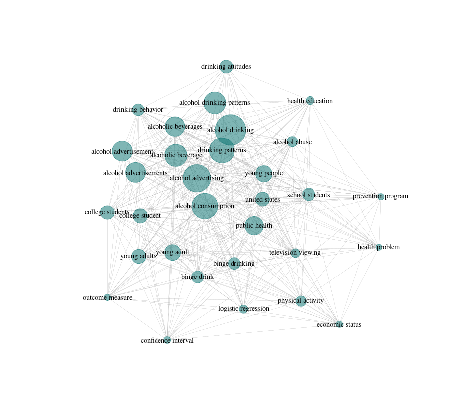

## How litsearchr identifies useful keywords

Because not all the keywords are relevant (and you probaby do not want to run a search with several thousand terms!), the next step is to determine which keywords are important to the topic of the systematic review and manually review those suggestions. 

To do this, `litsearchr` puts all of the terms into a keyword co-occurrence network. What this means is that if two terms both appear in the title/abstract/keywords of an article, they get marked as co-occurring. Terms that co-occur with other terms frequently are considered to be important to the topic because they are well-connected, especially if they are connected to other terms that are also well-connected. Building the keyword co-occurrence network lets litsearchr automatically identify which terms are probably important and suggest them as potential keywords. 

## Assessing how important terms are

First, we will create a document-feature matrix. What `litsearchr` will do is take the list of potential keywords and determine which articles they appear in. We once again use our `my_text` object we created earlier by pasting together titles, abstracts, and keywords. These are the elements in which we want to look for occurrences of our features, which are the raked_keywords. This code creates a large simple triplet matrix, so it can take a little while to run. 

~~~
naive_dfm <- create_dfm(
    elements = my_text,
    features = raked_keywords
  )
~~~
{: .language-r}

Now that we have a document-feature matrix, we can convert it to a network graph which makes it easy to to visualize relationships between terms and to assess their importance. We have the option to restrict how many studies a term must appear in to be included by using `min_studies` or how many times in total it appears with `min_occ`, however here we have left it the same as when we identified possible terms (2).

~~~
naive_graph <- create_network(
    search_dfm = as.matrix(naive_dfm),
    min_studies = 2,
    min_occ = 2
  )
~~~
{: .language-r}

> ## Check-in with helpers
> For virtual lessons: head to breakout rooms to check in with helpers.
{: .discussion}

Now that we have our network, we need to figure out which terms are the most important. One of the interesting things about keyword co-occurrence networks (and networks in general) is that their importance metrics follow a power law, where there are many terms with low importance and a few terms that are very important. To see what this looks like, we can extract the node `strength` from the network using the `igraph` package, `sort` the terms in order or their strenghts, and `plot` the node strengths.

~~~
# load the igraph library
library(igraph)

## Attaching package: ‘igraph’

## The following objects are masked from ‘package:stats’:

##    decompose, spectrum

## The following object is masked from ‘package:base’:

##    union
~~~
{: .language-r}

Next, we want to get the node `strength` for the graph and `sort` the strengths in decreasing order, so that the most important terms are at the top.

~~~
strengths <- sort(strength(naive_graph), decreasing=TRUE)

# then we can see the most important terms

head(strengths, 10)

##      alcohol consumption       alcohol advertising 
##                     1556                      1106 
##            public health          alcohol drinking 
##                     1046                      1026 
##        physical activity              young people 
##                      993                       896 
##          school students         drinking patterns 
##                      839                       820 
##            united states alcohol drinking patterns 
##                      722                       660 

# most of them look pretty relevant to the topic, which is good

~~~
{: .language-r}

To see what we mean by the network node strengths following a power law, let's plot our sorted vector of strengths. We will use `type="l"` to plot a line, and `las=1` to make our y-axis labels parallel with our x-axis so they are easy to read.

~~~
plot(strengths, type="l", las=1)
~~~
{: .language-r}

> ## Check-in with helpers
> For virtual lessons: head to breakout rooms to check in with helpers.
{: .discussion}

## Selecting important terms

We can use this power law relationship as a way to identify important terms. We want all the terms above some cutoff in importance, and do not want to consider the terms in the tail of the distribution. 

To find a cutoff in node importance, we can use the aptly-named `find_cutoff` function. With method `cumulative`, we can tell the function to return a cutoff that gives us the minimum number of terms that gives us 30% of the total importance in the network. 

~~~
cutoff <- find_cutoff(
    naive_graph,
    method = "cumulative",
    percent = .30,
    imp_method = "strength"
  )
  
print(cutoff)
## [1] 162
~~~
{: .language-r}

> ## Exercise: Changing cutoff stringency
> 
> In some cases, we may want to be more or less flexible with where the cutoff is placed for term importance.
> Using the code from the lesson as a template, find a new cutoff that returns 80% of the strength of the network.
> 
{: .challenge}

Next, we want to reduce our graph (`reduce_graph`) to only terms that have a node strength above our cutoff value. We can then get the keywords (`get_keywords`) that are still included in the network, which will give us a vector of important keywords to manually consider whether or not they should be included in the search terms. 

~~~
reduced_graph <- reduce_graph(naive_graph, cutoff_strength = cutoff)

search_terms <- get_keywords(reduced_graph)
~~~
{: .language-r}

> ## Challenge: Counting search terms
> How many terms has litsearchr suggested we review manually? Hint: `length` will be useful.
{: .challenge}

> ## Bonus Challenge
> 
> How many more search terms are retrieved when using a threshold of 50% instead of 30% of the network strength?
> 
> Hint: you will need to find cutoff values for both 50% and 30%, create two new reduced graphs with the different
> cutoff strengths, and check the `length` of the resulting search terms for each graph.
{: .challenge}
